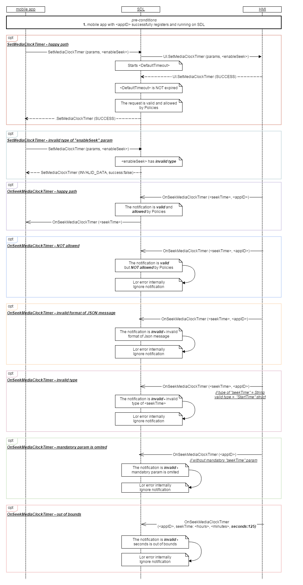

## OnSeekMediaClockTimer
  * Type: Notification
  * Sender: HMI
  * Purpose: Callback for the seek media clock timer notification
  
  
 **Behavior**  
 
 A notification will be provided if the user touches (or seeks) to a particular position on the HMI mediaclock timer. 
 The notification will contain a starttime with the position the user has seeked to.
   
!!! must
1. Send the notification to SDL with updated track time position in hours, minutes and seconds  
when the user selects the cursor on the head unit’s progress bar, drags it somewhere else in the track and releases it.

!!!

#### Parameters

|Name|Type|Mandatory|Additional|
|:---|:---|:--------|:---------|
|seekTime|[Commom.TimeFormat]|true|see [TimeFormat]|
|appID|Integer|true|The ID of application that relates to this media clock status change.|

[Commom.TimeFormat]: ../../common/structs/#timeformat
[TimeFormat]: ../../ui/setmediaclocktimer/#parameters

### Sequence Diagrams
|||
OnSeekMediaClockTimer notification with `enableSeek` param

|||

### JSON Example Notification
```json
{
  "jsonrpc" : "2.0",
  "method" : "UI.OnSeekMediaClockTimer",
  "params" :
  {
    "seekTime" : {
                "minutes": 1,
                "seconds": 33,
                "hours": 0        
                },
    "appID" : 753022517
  }
}
```